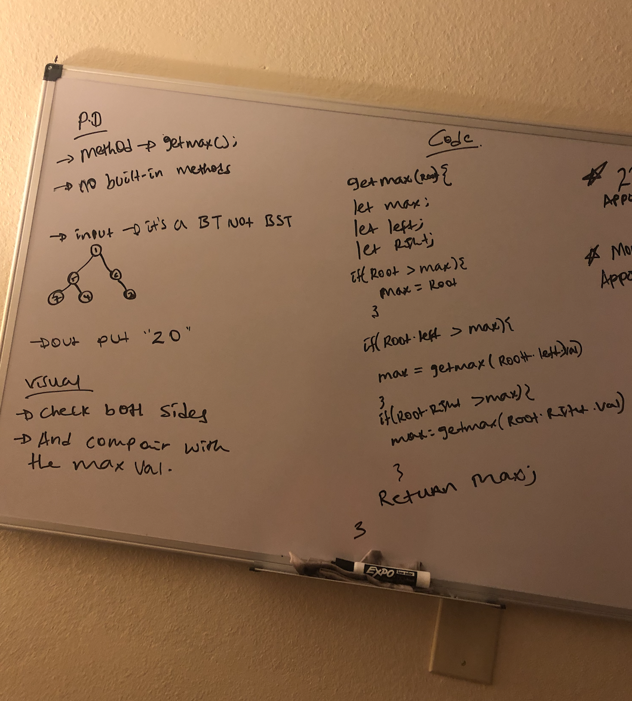

# data-stracture-and-algorithms-2

# data-stracture-and-algorithms-2

# Challenge Summary

- Getting the maximum value from a tree. I wrote a method on my previous binaryTree class.

## Challenge Description

- It was kind of tricky to use recursion method and follow the output while the recursion is happening.

## Approach & Efficiency

- I used the previous preOrder and inOrder method of class to get all the value of the tree.

## Solution

