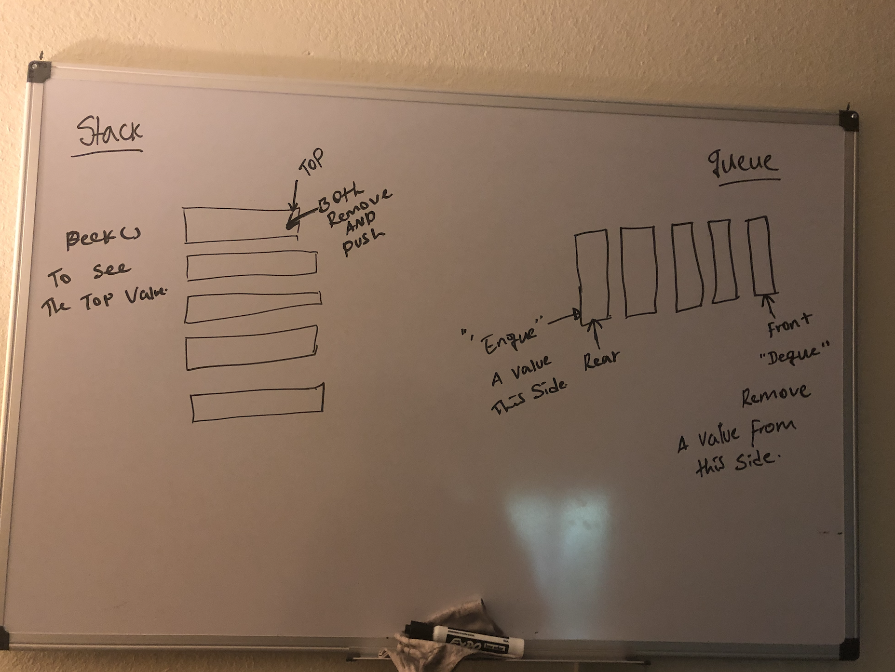

# data-stracture-and-algorithms-2

## table of contents 

## 401 Code Challenges

[stacks-and-queues](https://github.com/henok-6411/data-stracture-and-algorithms-2/pull/11)

##  Stack and Queues

- By using both methods how to push , remove , peek and check whether it's empty or not.

## Challenge

- It was difficult to debug my own test, It was tricky to write test for queue.

## Approach & Efficiency

- I used google to have a better understanding.

##  Solution

