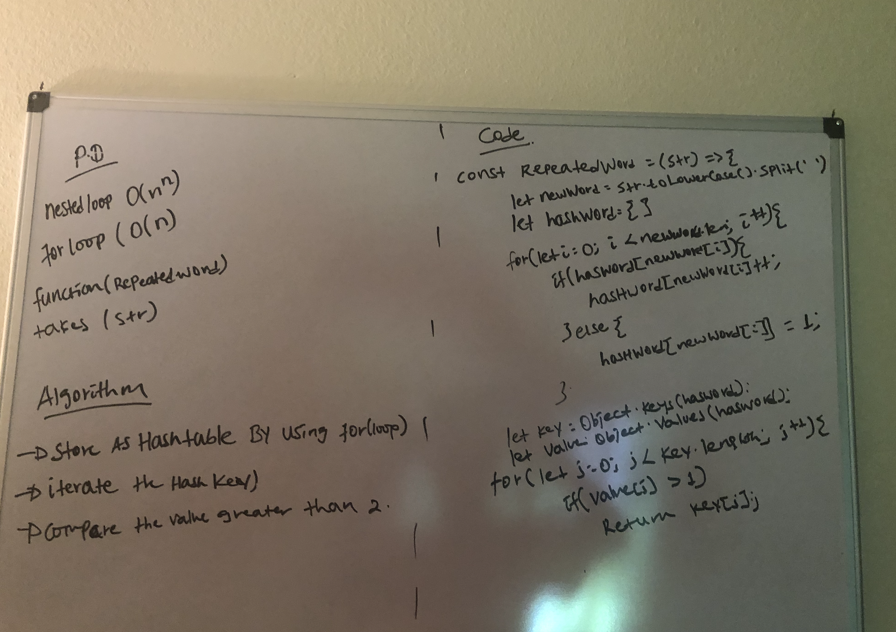

<<<<<<< HEAD
# Class 26 Code Challenge

- It take's a string as an argument and checked if is there any duplicated word from the given string.   

## Challenge
 - To store the string in the hashTable was a little bit challenging 

## Approach & Efficiency
- As i avoided nested loop to solve this problem, the time complexity is bigO(n);   
### UMI

=======
# Challenge Summary

- Getting the maximum value from a tree. I wrote a method on my previous binaryTree class.

## Challenge Description

- It was kind of tricky to use recursion method and follow the output while the recursion is happening.

## Approach & Efficiency

- I used the previous preOrder and inOrder method of class to get all the value of the tree.

## Solution

>>>>>>> c6d9ee93e0a2366579983db5068c6fd69d8b451a
