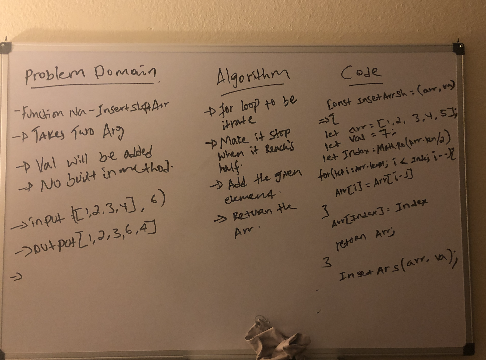

# data-stracture-and-algorithms-2

##  table of contents 

## 401 Code Challenges

[arrayReverse](arrayReverse/array-reverse.js)

[arrayShift](arrayShift/array-shift.js)

##  Insert element in to a given array.
* It will insert an element in to a given array. 

## Challenge

* It was difficult to make sure that i inseert it in the middle of the index's.

## Approach & Efficiency
* I mostly use my brain before i dive in to google, but at the end i used google. 

##  Solution

