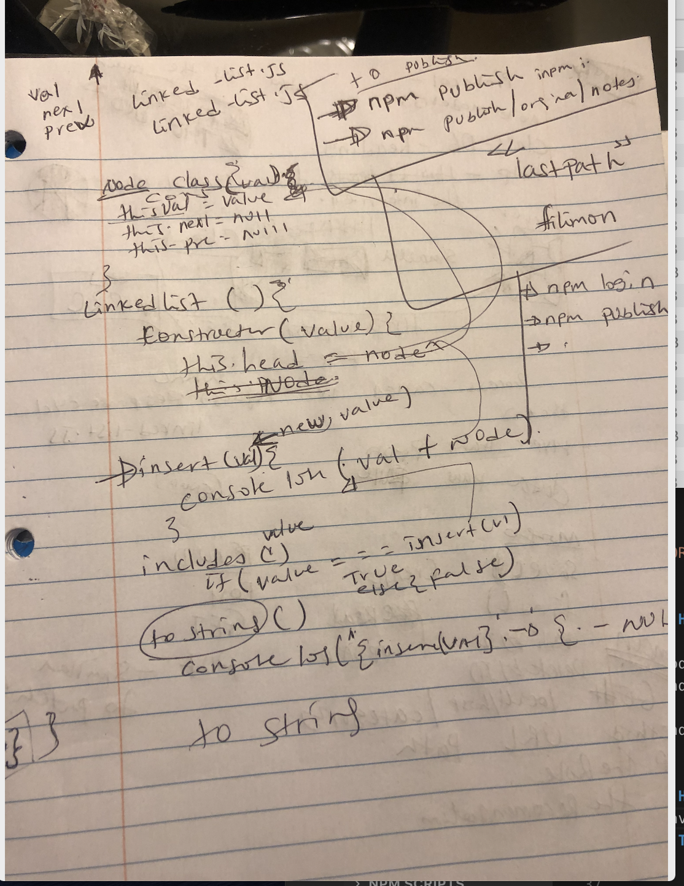

# LAB - Class 06 Code Challenge

## Project Name : Code Challenge

### Author: Henok Gebremedhn

### Links and Resources

- [submission PR](https://github.com/henok-6411/data-stracture-and-algorithms-2/pull/7)

### DOCUMENTATION 
[jsdoc](https://lab-401-demo.herokuapp.com/docs/)

### Setup

#### `.env` requirements (where applicable)

i.e.

- `PORT` - Port Number

#### How to initialize/run your application (where applicable)

 * node linked-list.js
 

#### How to use your library (where applicable)
 * Haven't publish it to npm.
#### Tests
* unit tests: 'npm test'
* lint test: 'npm run lint'
- Describe any tests that you did not complete, skipped, etc
- the Before inserting value didn't work for me.

#### UML

